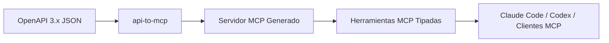

<p align="center">
  
</p>

<h1 align="center">API-2-MCP</h1>

<p align="center">
  <b>Genera servidores MCP listos para producción a partir de especificaciones OpenAPI.</b>
</p>

<p align="center">
  Convierte APIs REST en herramientas estructuradas que Claude Code, Codex y otros clientes MCP pueden ejecutar inmediatamente.
</p>

<p align="center">
  <a href="https://github.com/1692775560/API-2-MCP/actions/workflows/ci.yml"></a>
  =20">
  
  
  
</p>

<p align="center">
  <a href="README.md">English</a> ·
  <a href="README.zh-CN.md">简体中文</a> ·
  <a href="README.ja.md">日本語</a> ·
  <a href="README.ko.md">한국어</a> ·
  <a href="README.es.md">Español</a>
</p>

<p align="center">
  <a href="#quick-start">Inicio Rápido</a> ·
  <a href="#terminal-demo">Demo</a> ·
  <a href="#what-you-get">Qué Obtienes</a> ·
  <a href="#installing-for-agent-clients">Clientes de Agente</a> ·
  <a href="#supported-openapi-surface">Matriz de Soporte</a> ·
  <a href="#roadmap">Hoja de Ruta</a>
</p>

---

## ¿Qué es esto?

API-2-MCP es una CLI que convierte especificaciones OpenAPI 3.x en formato JSON en servidores MCP de TypeScript ejecutables. En lugar de escribir manualmente envoltorios (wrappers) de herramientas para cada endpoint de la API, le proporcionas a API-2-MCP una especificación y este produce un pequeño proyecto generado con esquemas de herramientas, mapeo de solicitudes, configuración de autenticación, scripts de construcción y una copia reproducible del documento OpenAPI original.



## ¿Por qué existe?

Los agentes solo son útiles cuando pueden llamar a herramientas reales de forma segura y predecible. La mayoría de las APIs de productos ya exponen su contrato a través de OpenAPI, pero convertir ese contrato en herramientas MCP es un trabajo repetitivo: analizar parámetros, construir esquemas de entrada, preservar el comportamiento de autenticación, mapear cuerpos de solicitud y mantener los proyectos generados fáciles de ejecutar.

API-2-MCP hace que ese camino sea directo:

| Problema | Resultado de API-2-MCP |
| --- | --- |
| Tienes una especificación OpenAPI pero ningún servidor MCP | Un servidor MCP de TypeScript generado |
| Tus endpoints tienen parámetros de ruta/query/header/body | Esquemas de entrada MCP derivados de la especificación |
| Tu API necesita tokens bearer o cabeceras de API-key | Configuración de autenticación generada basada en `.env` |
| Tu agente necesita nombres de herramientas estables | Nombres de herramientas basados en `operationId` o nombres normalizados de método/ruta |
| Tu equipo necesita una generación repetible | El `openapi.json` original se copia en el proyecto generado |

## Demo de Terminal

<p align="center">
  
</p>

La demo muestra el flujo de trabajo principal: instalar la CLI, generar un servidor a partir de `openapi.json`, construirlo, iniciarlo y exponer las herramientas resultantes a los clientes de agente.

Renderiza la demo localmente:

```bash
cd docs/remotion-terminal-demo
npm install
npm run preview
npm run render
npm run gif
```

Fuente: [`docs/remotion-terminal-demo`](docs/remotion-terminal-demo)  
Poster: [`docs/assets/terminal-demo-poster.png`](docs/assets/terminal-demo-poster.png)

## Inicio Rápido

Instala desde npm:

```bash
npm install -g @taozhang123/api-to-mcp
```

Genera a partir de un archivo OpenAPI JSON local:

```bash
api-to-mcp generate ./openapi.json --out ./my-mcp-server
```

O genera a partir de una URL de OpenAPI remota:

```bash
api-to-mcp create \
  --url https://api.example.com/openapi.json \
  --out ./my-mcp-server
```

Ejecuta el servidor MCP generado:

```bash
cd ./my-mcp-server
npm install
npm run build
npm start
```

También puedes ejecutarlo sin una instalación global:

```bash
npx @taozhang123/api-to-mcp generate ./openapi.json --out ./my-mcp-server
```

Instala directamente desde GitHub:

```bash
npm install -g github:1692775560/API-2-MCP
```

La instalación de GitHub funciona porque el paquete tiene un script `prepare` que construye `dist/` durante la instalación.

## Referencia de la CLI

### `generate`

Usa `generate` cuando ya tengas un archivo OpenAPI JSON local:

```bash
api-to-mcp generate <spec> --out <dir> [--name <name>] [--base-url <url>]
```

Ejemplo:

```bash
api-to-mcp generate ./openapi.json \
  --name petstore-mcp \
  --base-url https://petstore3.swagger.io/api/v3 \
  --out ./petstore-mcp
```

Opciones:

| Opción | Descripción |
| --- | --- |
| `<spec>` | Ruta a un archivo OpenAPI 3.x JSON |
| `--out <dir>` | Directorio de salida para el proyecto MCP generado |
| `--name <name>` | Nombre opcional del paquete/servidor generado |
| `--base-url <url>` | Sobrescribe la URL base de la API utilizada por el cliente generado |

### `create`

Usa `create` cuando quieras que API-2-MCP busque o descubra la especificación OpenAPI:

```bash
api-to-mcp create --url <url> --out <dir> [options]
```

Ejemplo:

```bash
api-to-mcp create \
  --url https://api.example.com/openapi.json \
  --auth bearer \
  --key "$API_TOKEN" \
  --out ./example-mcp
```

Opciones:

| Opción | Descripción |
| --- | --- |
| `--url <url>` | URL de OpenAPI JSON o URL base de la API |
| `--out <dir>` | Directorio de salida |
| `--key <key>` | Token bearer o API key para escribir en el `.env` generado |
| `--auth <type>` | `bearer` o `api-key`; por defecto es `bearer` |
| `--key-header <header>` | Nombre de la cabecera para `--auth api-key`; por defecto es `x-api-key` |
| `--name <name>` | Nombre opcional del paquete/servidor generado |
| `--base-url <url>` | Sobrescribe la URL base de la API |
| `--timeout-ms <ms>` | Tiempo de espera de descubrimiento por solicitud; por defecto `10000` |

Cuando `--url` es una URL base de API, API-2-MCP sondea rutas de descubrimiento comunes:

```text
/openapi.json
/swagger.json
/v3/api-docs
/.well-known/openapi.json
```

## Ejemplos de Autenticación

Token Bearer:

```bash
api-to-mcp create \
  --url https://api.example.com/openapi.json \
  --key "$API_TOKEN" \
  --out ./my-mcp-server
```

Cabecera API-key:

```bash
api-to-mcp create \
  --url https://api.example.com/openapi.json \
  --auth api-key \
  --key "$API_KEY" \
  --key-header x-api-key \
  --out ./my-mcp-server
```

Los secretos generados se escriben en `.env`. Mantén el archivo `.env` fuera de git y evita pegar claves de API reales en transcripciones de chat, configuraciones globales de agentes o informes de errores públicos.

## Qué Obtienes

Un proyecto generado es intencionalmente pequeño y fácil de inspeccionar:

```text
my-mcp-server/
  .env.example
  openapi.json
  package.json
  README.md
  tsconfig.json
  src/
    index.ts
```

Comportamiento generado:

| Área | Resultado generado |
| --- | --- |
| Herramientas | Una herramienta MCP por cada operación de OpenAPI |
| Entradas | Esquemas de parámetros de ruta, query, header, cookie y cuerpo JSON |
| Solicitudes | Cliente de tiempo de ejecución que mapea entradas de herramientas en solicitudes REST |
| Autenticación | Token Bearer o cabecera API-key a través de variables de entorno |
| Etiquetas de seguridad | Anotaciones conservadoras de lectura/escritura/destructivas basadas en el método HTTP |
| Ejecución | Servidor MCP de TypeScript sobre stdio |
| Docs | README generado, `.env.example` y copia de `openapi.json` |

## Cómo se mapea OpenAPI a MCP

| Concepto OpenAPI | Resultado MCP |
| --- | --- |
| `operationId` | Nombre de herramienta preferido |
| `summary` / `description` | Descripción de la herramienta |
| Parámetros de ruta | Campos de entrada obligatorios |
| Parámetros de query | Campos de entrada opcionales u obligatorios según la especificación |
| Parámetros de header/cookie | Campos de entrada mapeados en metadatos de solicitud |
| `requestBody` JSON | Objeto de entrada anidado |
| Método HTTP | Clasificación de lectura/escritura/destructiva |
| `servers.url` | URL base de la API generada |

Si una especificación local utiliza una `servers.url` relativa, pasa `--base-url` para que el servidor generado pueda llamar a la API real.

## Instalación para Clientes de Agente

API-2-MCP incluye un comando slash para Claude Code y una habilidad para Codex. Instala ambos desde un checkout local:

```bash
git clone https://github.com/1692775560/API-2-MCP.git
cd API-2-MCP
npm install
npm run build
npm run install:agent-command
```

Luego usa Claude Code:

```text
/api-to-mcp generate ./openapi.json --out ./my-mcp-server
/api-to-mcp create --url https://api.example.com/openapi.json --out ./my-mcp-server
```

Para Codex, pídele que use la habilidad `api-to-mcp` y proporciona los mismos argumentos de la CLI.

## Ejemplo: Servidor MCP de DeepSeek

Genera a partir del ejemplo de OpenAPI de DeepSeek incluido:

```bash
npm run build
npm run generate:deepseek
```

Ejecuta una prueba de humo en vivo con tu propia clave:

```bash
export DEEPSEEK_API_KEY="sk-..."
npm run smoke:deepseek
```

La prueba de humo genera el servidor, lo inicia sobre stdio, enumera las herramientas y llama a la herramienta de completado de chat generada.

## Ejemplo: Petstore

```bash
npm run build
npm run generate:petstore
cd examples/petstore/generated
npm install
npm run build
npm start
```

Esta es la forma más rápida de inspeccionar un proyecto generado sin usar una clave de API privada.

## Matriz de Soporte de OpenAPI

| Característica | Estado |
| --- | --- |
| OpenAPI 3.x JSON | Soportado |
| Resolución de `$ref` local | Soportado |
| Esquemas de cuerpo `allOf`, `anyOf`, `oneOf` | Soportado |
| Parámetros a nivel de ruta y de operación | Soportado |
| Parámetros de Query, path, header, cookie | Soportado |
| Cuerpos de solicitud JSON | Soportado |
| URLs de servidor relativas | Soportado con `--base-url` o URL de origen |
| Descubrimiento de especificaciones remotas | Soportado para endpoints JSON comunes |
| Entrada YAML | Planeado |
| Swagger 2.0 | No soportado |
| Generación de ayudantes OAuth | Planeado |

## Desarrollo

```bash
npm install
npm run typecheck
npm test
npm run check
```

Puertas de calidad:

| Comando | Propósito |
| --- | --- |
| `npm run typecheck` | Validación de TypeScript |
| `npm test` | Pruebas unitarias para parseo, generación y carga de especificaciones remotas |
| `npm run check` | Probar, construir y regenerar los ejemplos incluidos |
| `npm pack --dry-run` | Verificar el contenido del paquete antes de publicar |

La CI se ejecuta en Node.js 20 y 22.

## Solución de Problemas

| Síntoma | Solución |
| --- | --- |
| `servers.url` es relativo | Ejecuta de nuevo con `--base-url https://api.example.com` |
| La URL base de la API no es una URL de OpenAPI JSON | Usa `create --url <base-url>` para que el descubrimiento pueda sondear rutas comunes |
| El servidor generado no puede autenticarse | Revisa el `.env` generado y el modo `--auth` seleccionado |
| Los nombres de las herramientas parecen genéricos | Agrega valores de `operationId` a la especificación OpenAPI antes de la generación |
| La especificación YAML falla | Conviértela primero a OpenAPI 3.x JSON |
| La especificación Swagger 2.0 falla | Convierte Swagger 2.0 a OpenAPI 3.x primero |

## Hoja de Ruta

- Entrada YAML
- Entrada de colecciones de Postman
- Generación de ayudantes OAuth
- Listas blancas y filtrado de herramientas
- Opciones adicionales de tiempo de ejecución generadas
- Generación de tiempo de ejecución en Python
- Automatización de lanzamientos y procedencia de npm

## Licencia

MIT
