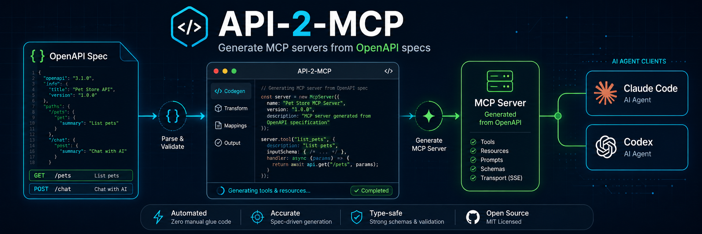

<p align="center">
  
</p>

<h1 align="center">API-2-MCP</h1>

<p align="center">
  <b>OpenAPI 仕様から実行可能な MCP Server を生成します。</b>
</p>

<p align="center">
  REST API を Claude Code、Codex、その他の MCP クライアントから使える構造化ツールに変換します。
</p>

<p align="center">
  <a href="https://github.com/1692775560/API-2-MCP/actions/workflows/ci.yml"></a>
  =20">
  
  
  
</p>

<p align="center">
  <a href="README.md">English</a> ·
  <a href="README.zh-CN.md">简体中文</a> ·
  <a href="README.ja.md">日本語</a> ·
  <a href="README.ko.md">한국어</a> ·
  <a href="README.es.md">Español</a>
</p>

<p align="center">
  <a href="#quick-start">Quick Start</a> ·
  <a href="#what-it-generates">What It Generates</a> ·
  <a href="#claude-code--codex">Claude Code & Codex</a> ·
  <a href="#deepseek-example">DeepSeek Example</a> ·
  <a href="#roadmap">Roadmap</a>
</p>

---

## Why API-2-MCP

AI Agent には、安定して発見しやすい構造化ツールが必要です。多くの API
はすでに OpenAPI で記述されていますが、それらを MCP tool として手作業で
ラップするのは反復的でミスも起きやすい作業です。API-2-MCP は OpenAPI
3.x JSON 仕様を読み取り、入力 schema、認証環境変数、operation から tool
へのマッピングを含む TypeScript MCP Server を生成します。

| Input | Output |
| --- | --- |
| OpenAPI 3.x JSON spec | TypeScript MCP Server |
| REST path/query/header/body params | MCP tool input schemas |
| API keys and bearer tokens | `.env`-driven generated clients |
| API operation IDs | Agent-callable MCP tools |
| Local specs or remote URLs | Ready-to-run generated projects |

## Quick Start

GitHub から直接実行:

```bash
npx --yes @api2mcp/cli generate ./openapi.json --out ./my-mcp-server
```

リモート URL から OpenAPI 仕様を取得または検出:

```bash
npx --yes @api2mcp/cli create \
  --url https://api.example.com/openapi.json \
  --out ./my-mcp-server
```

生成された MCP Server を起動:

```bash
cd ./my-mcp-server
npm install
npm run build
npm start
```

## Install From Source

```bash
git clone https://github.com/1692775560/API-2-MCP.git
cd API-2-MCP
npm install
npm run build
```

同梱サンプルを生成:

```bash
npm run generate:petstore
npm run generate:deepseek
```

ローカルチェック:

```bash
npm run check
```

## CLI

### Generate From A Local Spec

```bash
npx --yes @api2mcp/cli generate ./openapi.json --out ./my-mcp-server
```

`servers.url` が相対 URL の場合は `--base-url` を指定してください:

```bash
npx --yes @api2mcp/cli generate ./openapi.json \
  --base-url https://api.example.com \
  --out ./my-mcp-server
```

### Create From A URL

```bash
npx --yes @api2mcp/cli create \
  --url https://api.example.com/openapi.json \
  --out ./my-mcp-server
```

`--url` が OpenAPI JSON ではなく API のベース URL の場合、API-2-MCP は
以下の一般的な discovery path を試します:

- `/openapi.json`
- `/swagger.json`
- `/v3/api-docs`
- `/.well-known/openapi.json`

### Auth Options

Bearer token:

```bash
npx --yes @api2mcp/cli create \
  --url https://api.example.com/openapi.json \
  --key "$API_TOKEN" \
  --out ./my-mcp-server
```

API-key header:

```bash
npx --yes @api2mcp/cli create \
  --url https://api.example.com/openapi.json \
  --auth api-key \
  --key "$API_KEY" \
  --key-header x-api-key \
  --out ./my-mcp-server
```

シークレットは生成された `.env` ファイルに書き込まれます。API key を公開
チャットログやグローバルな Agent 設定に貼り付けないでください。

## What It Generates

生成されるプロジェクトには以下が含まれます:

- OpenAPI operation ごとの MCP tool 登録
- path、query、header、cookie、JSON body から生成される入力 schema
- 環境変数による API key / bearer token 認証
- 生成プロジェクト用 README と `.env.example`
- 再現性のためにコピーされた `openapi.json`
- HTTP method に基づく read/write/destructive ラベル
- stdio で動作する TypeScript MCP Server

```text
my-mcp-server/
  .env.example
  openapi.json
  package.json
  README.md
  src/
    index.ts
```

## Claude Code & Codex

Claude Code slash command と Codex skill をインストール:

```bash
git clone https://github.com/1692775560/API-2-MCP.git
cd API-2-MCP
npm install
npm run build
npm run install:agent-command
```

Claude Code で使用:

```text
/api-to-mcp generate ./openapi.json --out ./my-mcp-server
/api-to-mcp create --url https://api.example.com/openapi.json --out ./my-mcp-server
```

Codex では同梱 skill をインストールしたあと、同じ引数で `api-to-mcp` skill
を使うよう依頼します。

## DeepSeek Example

```bash
npm run build
npm run generate:deepseek
```

ライブ smoke test:

```bash
export DEEPSEEK_API_KEY="sk-..."
npm run smoke:deepseek
```

## Supported Specs

| Feature | Status |
| --- | --- |
| OpenAPI 3.x JSON | Supported |
| Local `$ref` resolution | Supported |
| `allOf`, `anyOf`, `oneOf` body schemas | Supported |
| Path-level and operation-level params | Supported |
| Query, path, header, cookie params | Supported |
| Relative server URLs | Supported with `--base-url` or source URL |
| Swagger 2.0 | Not supported |
| YAML input | Planned |

## Development

```bash
npm install
npm run typecheck
npm test
npm run check
```

CI runs on Node.js 20 and 22.

## Roadmap

- YAML input
- Postman collections
- OAuth helpers
- Tool allowlists
- More generated runtime options
- Python runtime
- Published npm package

## License

MIT
