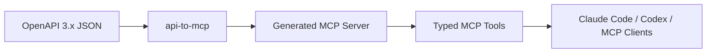
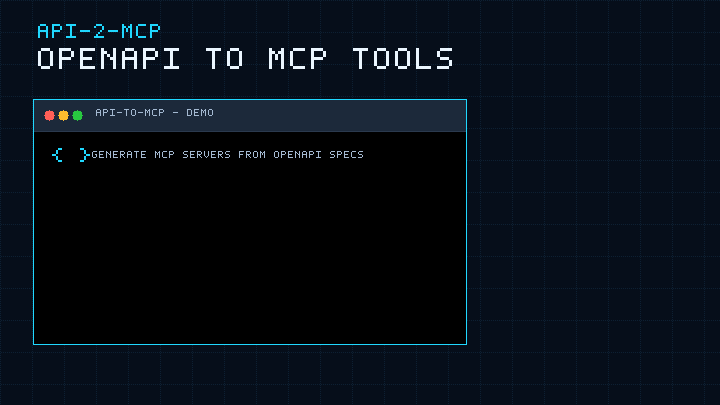

<p align="center">
  
</p>

<h1 align="center">API-2-MCP</h1>

<p align="center">
  <b>Generate production-ready MCP servers from OpenAPI specs.</b>
</p>

<p align="center">
  Turn REST APIs into structured tools that Claude Code, Codex, and other MCP clients can call immediately.
</p>

<p align="center">
  <a href="https://github.com/1692775560/API-2-MCP/actions/workflows/ci.yml"></a>
  =20">
  
  
  
</p>

<p align="center">
  <a href="README.md">English</a> ·
  <a href="README.zh-CN.md">简体中文</a> ·
  <a href="README.ja.md">日本語</a> ·
  <a href="README.ko.md">한국어</a> ·
  <a href="README.es.md">Español</a>
</p>

<p align="center">
  <a href="#quick-start">Quick Start</a> ·
  <a href="#terminal-demo">Demo</a> ·
  <a href="#what-you-get">What You Get</a> ·
  <a href="#installing-for-agent-clients">Agent Clients</a> ·
  <a href="#supported-openapi-surface">Support Matrix</a> ·
  <a href="#roadmap">Roadmap</a>
</p>

---

## What Is This?

API-2-MCP is a CLI that converts OpenAPI 3.x JSON specs into runnable TypeScript
MCP servers. Instead of hand-writing tool wrappers for every API endpoint, you
give API-2-MCP a spec and it produces a small generated project with tool
schemas, request mapping, auth wiring, build scripts, and a reproducible copy of
the source OpenAPI document.



## Why It Exists

Agents are only useful when they can call real tools safely and predictably.
Most product APIs already expose their contract through OpenAPI, but turning
that contract into MCP tools is repetitive work: parse parameters, build input
schemas, preserve auth behavior, map request bodies, and keep generated projects
easy to run.

API-2-MCP makes that path direct:

| Problem | API-2-MCP output |
| --- | --- |
| You have an OpenAPI spec but no MCP server | A generated TypeScript MCP server |
| Your endpoints have path/query/header/body params | MCP input schemas derived from the spec |
| Your API needs bearer tokens or API-key headers | `.env`-based generated auth wiring |
| Your agent needs stable tool names | Tool names from `operationId` or normalized method/path names |
| Your team needs repeatable generation | The original `openapi.json` is copied into the generated project |

## Terminal Demo

<p align="center">
  
</p>

The demo shows the core workflow: install the CLI, generate a server from
`openapi.json`, build it, start it, and expose the resulting tools to agent
clients.

Render the demo locally:

```bash
cd docs/remotion-terminal-demo
npm install
npm run preview
npm run render
npm run gif
```

Source: [`docs/remotion-terminal-demo`](docs/remotion-terminal-demo)  
Poster: [`docs/assets/terminal-demo-poster.png`](docs/assets/terminal-demo-poster.png)

## Quick Start

Install from npm:

```bash
npm install -g @taozhang123/api-to-mcp
```

Generate from a local OpenAPI JSON file:

```bash
api-to-mcp generate ./openapi.json --out ./my-mcp-server
```

Or generate from a remote OpenAPI URL:

```bash
api-to-mcp create \
  --url https://api.example.com/openapi.json \
  --out ./my-mcp-server
```

Run the generated MCP server:

```bash
cd ./my-mcp-server
npm install
npm run build
npm start
```

You can also run it without a global install:

```bash
npx @taozhang123/api-to-mcp generate ./openapi.json --out ./my-mcp-server
```

Install directly from GitHub:

```bash
npm install -g github:1692775560/API-2-MCP
```

The GitHub install works because the package has a `prepare` script that builds
`dist/` during installation.

## CLI Reference

### `generate`

Use `generate` when you already have a local OpenAPI JSON file:

```bash
api-to-mcp generate <spec> --out <dir> [--name <name>] [--base-url <url>]
```

Example:

```bash
api-to-mcp generate ./openapi.json \
  --name petstore-mcp \
  --base-url https://petstore3.swagger.io/api/v3 \
  --out ./petstore-mcp
```

Options:

| Option | Description |
| --- | --- |
| `<spec>` | Path to an OpenAPI 3.x JSON file |
| `--out <dir>` | Output directory for the generated MCP project |
| `--name <name>` | Optional generated package/server name |
| `--base-url <url>` | Override the API base URL used by the generated client |

### `create`

Use `create` when you want API-2-MCP to fetch or discover the OpenAPI spec:

```bash
api-to-mcp create --url <url> --out <dir> [options]
```

Example:

```bash
api-to-mcp create \
  --url https://api.example.com/openapi.json \
  --auth bearer \
  --key "$API_TOKEN" \
  --out ./example-mcp
```

Options:

| Option | Description |
| --- | --- |
| `--url <url>` | OpenAPI JSON URL or API base URL |
| `--out <dir>` | Output directory |
| `--key <key>` | Bearer token or API key to write into the generated `.env` |
| `--auth <type>` | `bearer` or `api-key`; defaults to `bearer` |
| `--key-header <header>` | Header name for `--auth api-key`; defaults to `x-api-key` |
| `--name <name>` | Optional generated package/server name |
| `--base-url <url>` | Override the API base URL |
| `--timeout-ms <ms>` | Per-request discovery timeout; defaults to `10000` |

When `--url` is an API base URL, API-2-MCP probes common discovery paths:

```text
/openapi.json
/swagger.json
/v3/api-docs
/.well-known/openapi.json
```

## Auth Examples

Bearer token:

```bash
api-to-mcp create \
  --url https://api.example.com/openapi.json \
  --key "$API_TOKEN" \
  --out ./my-mcp-server
```

API-key header:

```bash
api-to-mcp create \
  --url https://api.example.com/openapi.json \
  --auth api-key \
  --key "$API_KEY" \
  --key-header x-api-key \
  --out ./my-mcp-server
```

Generated secrets are written to `.env`. Keep `.env` out of git and avoid
pasting raw API keys into chat transcripts, global agent settings, or public
issue reports.

## What You Get

A generated project is intentionally small and easy to inspect:

```text
my-mcp-server/
  .env.example
  openapi.json
  package.json
  README.md
  tsconfig.json
  src/
    index.ts
```

Generated behavior:

| Area | Generated output |
| --- | --- |
| Tools | One MCP tool per OpenAPI operation |
| Inputs | Schemas from path, query, header, cookie, and JSON body params |
| Requests | Runtime client that maps tool inputs into REST requests |
| Auth | Bearer token or API-key header through environment variables |
| Safety labels | Conservative read/write/destructive annotations based on HTTP method |
| Runtime | TypeScript MCP server over stdio |
| Docs | Generated README, `.env.example`, and copied `openapi.json` |

## How OpenAPI Maps To MCP

| OpenAPI concept | MCP result |
| --- | --- |
| `operationId` | Preferred tool name |
| `summary` / `description` | Tool description |
| Path parameters | Required input fields |
| Query parameters | Optional or required input fields based on the spec |
| Header/cookie parameters | Input fields mapped into request metadata |
| JSON `requestBody` | Nested input object |
| HTTP method | Read/write/destructive classification |
| `servers.url` | Generated API base URL |

If a local spec uses a relative `servers.url`, pass `--base-url` so the
generated server can call the real API.

## Installing For Agent Clients

API-2-MCP includes a Claude Code slash command and a Codex skill. Install both
from a local checkout:

```bash
git clone https://github.com/1692775560/API-2-MCP.git
cd API-2-MCP
npm install
npm run build
npm run install:agent-command
```

Then use Claude Code:

```text
/api-to-mcp generate ./openapi.json --out ./my-mcp-server
/api-to-mcp create --url https://api.example.com/openapi.json --out ./my-mcp-server
```

For Codex, ask it to use the `api-to-mcp` skill and provide the same CLI
arguments.

## Example: DeepSeek MCP Server

Generate from the bundled DeepSeek OpenAPI example:

```bash
npm run build
npm run generate:deepseek
```

Run a live smoke test with your own key:

```bash
export DEEPSEEK_API_KEY="sk-..."
npm run smoke:deepseek
```

The smoke test generates the server, starts it over stdio, lists tools, and
calls the generated chat completion tool.

## Example: Petstore

```bash
npm run build
npm run generate:petstore
cd examples/petstore/generated
npm install
npm run build
npm start
```

This is the fastest way to inspect a generated project without using a private
API key.

## Supported OpenAPI Surface

| Feature | Status |
| --- | --- |
| OpenAPI 3.x JSON | Supported |
| Local `$ref` resolution | Supported |
| `allOf`, `anyOf`, `oneOf` body schemas | Supported |
| Path-level and operation-level parameters | Supported |
| Query, path, header, cookie parameters | Supported |
| JSON request bodies | Supported |
| Relative server URLs | Supported with `--base-url` or source URL |
| Remote spec discovery | Supported for common JSON endpoints |
| YAML input | Planned |
| Swagger 2.0 | Not supported |
| OAuth helper generation | Planned |

## Development

```bash
npm install
npm run typecheck
npm test
npm run check
```

Quality gates:

| Command | Purpose |
| --- | --- |
| `npm run typecheck` | TypeScript validation |
| `npm test` | Unit tests for parsing, generation, and remote spec loading |
| `npm run check` | Test, build, and regenerate bundled examples |
| `npm pack --dry-run` | Verify package contents before publishing |

CI runs on Node.js 20 and 22.

## Troubleshooting

| Symptom | Fix |
| --- | --- |
| `servers.url` is relative | Re-run with `--base-url https://api.example.com` |
| The API base URL is not an OpenAPI JSON URL | Use `create --url <base-url>` so discovery can probe common paths |
| Generated server cannot authenticate | Check the generated `.env` and the selected `--auth` mode |
| Tool names look generic | Add `operationId` values to the OpenAPI spec before generation |
| YAML spec fails | Convert it to OpenAPI 3.x JSON first |
| Swagger 2.0 spec fails | Convert Swagger 2.0 to OpenAPI 3.x first |

## Roadmap

- YAML input
- Postman collection input
- OAuth helper generation
- Tool allowlists and filtering
- Additional generated runtime options
- Python runtime generation
- Release automation and npm provenance

## License

MIT
