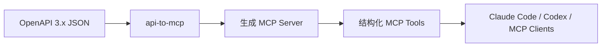

<p align="center">
  
</p>

<h1 align="center">API-2-MCP</h1>

<p align="center">
  <b>从 OpenAPI 规范一键生成可运行的 MCP Server。</b>
</p>

<p align="center">
  把 REST API 变成 Claude Code、Codex 和其他 MCP 客户端可以直接调用的结构化工具。
</p>

<p align="center">
  <a href="https://github.com/1692775560/API-2-MCP/actions/workflows/ci.yml"></a>
  =20">
  
  
  
</p>

<p align="center">
  <a href="README.md">English</a> ·
  <a href="README.zh-CN.md">简体中文</a> ·
  <a href="README.ja.md">日本語</a> ·
  <a href="README.ko.md">한국어</a> ·
  <a href="README.es.md">Español</a>
</p>

<p align="center">
  <a href="#快速开始">快速开始</a> ·
  <a href="#终端演示">终端演示</a> ·
  <a href="#生成内容">生成内容</a> ·
  <a href="#安装到-agent-客户端">Agent 客户端</a> ·
  <a href="#openapi-支持范围">支持范围</a> ·
  <a href="#路线图">路线图</a>
</p>

---

## 这是什么？

API-2-MCP 是一个 CLI，可以把 OpenAPI 3.x JSON 规范转换成可运行的
TypeScript MCP Server。你不需要为每个 API endpoint 手写 tool wrapper，只要
给它一份 spec，它就会生成一个小型项目，里面包含 tool schema、请求映射、
鉴权配置、构建脚本，以及用于复现的原始 OpenAPI 文件。



## 为什么需要它

Agent 真正有用的前提，是能稳定、可控地调用真实工具。大多数产品 API 已经
有 OpenAPI 规范，但把这些接口转换成 MCP tools 仍然有大量重复劳动：解析
参数、生成输入 schema、保留鉴权方式、映射 request body，并让生成项目可
构建、可运行、可复现。

API-2-MCP 让这条路径更直接：

| 问题 | API-2-MCP 输出 |
| --- | --- |
| 有 OpenAPI spec，但没有 MCP server | 生成 TypeScript MCP Server |
| 接口有 path/query/header/body 参数 | 从 spec 派生 MCP input schema |
| API 需要 Bearer Token 或 API Key | 基于 `.env` 的生成鉴权逻辑 |
| Agent 需要稳定 tool 名称 | 优先使用 `operationId`，否则标准化 method/path |
| 团队需要可复现生成 | 原始 `openapi.json` 会复制到生成项目中 |

## 终端演示

<p align="center">
  
</p>

这个演示展示了核心流程：安装 CLI、从 `openapi.json` 生成 server、构建、启动，
并把生成出来的 tools 暴露给 Agent 客户端。

本地渲染演示动画：

```bash
cd docs/remotion-terminal-demo
npm install
npm run preview
npm run render
npm run gif
```

动画源码：[`docs/remotion-terminal-demo`](docs/remotion-terminal-demo)  
静态封面：[`docs/assets/terminal-demo-poster.png`](docs/assets/terminal-demo-poster.png)

## 快速开始

从 npm 安装：

```bash
npm install -g @taozhang123/api-to-mcp
```

从本地 OpenAPI JSON 文件生成：

```bash
api-to-mcp generate ./openapi.json --out ./my-mcp-server
```

或者从远程 OpenAPI URL 生成：

```bash
api-to-mcp create \
  --url https://api.example.com/openapi.json \
  --out ./my-mcp-server
```

运行生成后的 MCP Server：

```bash
cd ./my-mcp-server
npm install
npm run build
npm start
```

也可以不全局安装，直接使用 `npx`：

```bash
npx @taozhang123/api-to-mcp generate ./openapi.json --out ./my-mcp-server
```

也支持从 GitHub 直接安装：

```bash
npm install -g github:1692775560/API-2-MCP
```

GitHub 安装可用，是因为包里配置了 `prepare` 脚本，安装时会自动构建 `dist/`。

## CLI 用法

### `generate`

当你已经有本地 OpenAPI JSON 文件时，使用 `generate`：

```bash
api-to-mcp generate <spec> --out <dir> [--name <name>] [--base-url <url>]
```

示例：

```bash
api-to-mcp generate ./openapi.json \
  --name petstore-mcp \
  --base-url https://petstore3.swagger.io/api/v3 \
  --out ./petstore-mcp
```

参数：

| 参数 | 说明 |
| --- | --- |
| `<spec>` | OpenAPI 3.x JSON 文件路径 |
| `--out <dir>` | 生成 MCP 项目的输出目录 |
| `--name <name>` | 可选的生成 package/server 名称 |
| `--base-url <url>` | 覆盖生成客户端使用的 API base URL |

### `create`

当你希望 API-2-MCP 自动获取或发现 OpenAPI spec 时，使用 `create`：

```bash
api-to-mcp create --url <url> --out <dir> [options]
```

示例：

```bash
api-to-mcp create \
  --url https://api.example.com/openapi.json \
  --auth bearer \
  --key "$API_TOKEN" \
  --out ./example-mcp
```

参数：

| 参数 | 说明 |
| --- | --- |
| `--url <url>` | OpenAPI JSON URL，或 API 根地址 |
| `--out <dir>` | 输出目录 |
| `--key <key>` | 写入生成 `.env` 的 Bearer Token 或 API Key |
| `--auth <type>` | `bearer` 或 `api-key`，默认 `bearer` |
| `--key-header <header>` | `--auth api-key` 时使用的 header，默认 `x-api-key` |
| `--name <name>` | 可选的生成 package/server 名称 |
| `--base-url <url>` | 覆盖生成客户端使用的 API base URL |
| `--timeout-ms <ms>` | 每次 OpenAPI 探测请求的超时时间，默认 `10000` |

如果 `--url` 是 API 根地址，API-2-MCP 会探测常见路径：

```text
/openapi.json
/swagger.json
/v3/api-docs
/.well-known/openapi.json
```

## 鉴权示例

Bearer Token：

```bash
api-to-mcp create \
  --url https://api.example.com/openapi.json \
  --key "$API_TOKEN" \
  --out ./my-mcp-server
```

API Key Header：

```bash
api-to-mcp create \
  --url https://api.example.com/openapi.json \
  --auth api-key \
  --key "$API_KEY" \
  --key-header x-api-key \
  --out ./my-mcp-server
```

生成的密钥会写入 `.env`。不要把 `.env` 提交到 git，也不要把原始 API Key 粘贴
到公开聊天记录、全局 Agent 设置或 issue 里。

## 生成内容

生成项目会保持小而清晰，方便检查：

```text
my-mcp-server/
  .env.example
  openapi.json
  package.json
  README.md
  tsconfig.json
  src/
    index.ts
```

生成行为：

| 模块 | 生成结果 |
| --- | --- |
| Tools | 每个 OpenAPI operation 生成一个 MCP tool |
| Inputs | 从 path、query、header、cookie、JSON body 参数生成 schema |
| Requests | 运行时客户端会把 tool input 映射成 REST 请求 |
| Auth | 通过环境变量支持 Bearer Token 或 API Key Header |
| Safety labels | 基于 HTTP method 标注 read/write/destructive |
| Runtime | 基于 stdio 的 TypeScript MCP Server |
| Docs | 生成 README、`.env.example`，并复制 `openapi.json` |

## OpenAPI 如何映射到 MCP

| OpenAPI 概念 | MCP 结果 |
| --- | --- |
| `operationId` | 优先作为 tool 名称 |
| `summary` / `description` | 作为 tool 描述 |
| Path parameters | 必填 input 字段 |
| Query parameters | 按 spec 标记为可选或必填 input 字段 |
| Header/cookie parameters | 映射到请求 metadata 的 input 字段 |
| JSON `requestBody` | 嵌套 input object |
| HTTP method | read/write/destructive 分类 |
| `servers.url` | 生成 API base URL |

如果本地 spec 使用相对 `servers.url`，请传入 `--base-url`，否则生成 server 不知道
真实 API 地址。

## 安装到 Agent 客户端

API-2-MCP 内置 Claude Code slash command 和 Codex skill。可以从本地 checkout
安装：

```bash
git clone https://github.com/1692775560/API-2-MCP.git
cd API-2-MCP
npm install
npm run build
npm run install:agent-command
```

然后在 Claude Code 中使用：

```text
/api-to-mcp generate ./openapi.json --out ./my-mcp-server
/api-to-mcp create --url https://api.example.com/openapi.json --out ./my-mcp-server
```

在 Codex 中，让它使用 `api-to-mcp` skill，并提供同样的 CLI 参数即可。

## 示例：DeepSeek MCP Server

从内置 DeepSeek OpenAPI 示例生成：

```bash
npm run build
npm run generate:deepseek
```

使用自己的 key 运行在线 smoke test：

```bash
export DEEPSEEK_API_KEY="sk-..."
npm run smoke:deepseek
```

Smoke test 会生成 server，通过 stdio 启动它，列出 tools，并调用生成的 chat
completion tool。

## 示例：Petstore

```bash
npm run build
npm run generate:petstore
cd examples/petstore/generated
npm install
npm run build
npm start
```

这是不用私有 API Key 就能检查生成项目的最快方式。

## OpenAPI 支持范围

| 能力 | 状态 |
| --- | --- |
| OpenAPI 3.x JSON | 已支持 |
| 本地 `$ref` 解析 | 已支持 |
| `allOf`、`anyOf`、`oneOf` body schema | 已支持 |
| path-level 和 operation-level 参数 | 已支持 |
| query、path、header、cookie 参数 | 已支持 |
| JSON request body | 已支持 |
| 相对 server URL | 通过 `--base-url` 或 source URL 支持 |
| 远程 spec 发现 | 支持常见 JSON endpoint |
| YAML 输入 | 计划中 |
| Swagger 2.0 | 暂不支持 |
| OAuth 辅助生成 | 计划中 |

## 开发

```bash
npm install
npm run typecheck
npm test
npm run check
```

质量检查：

| 命令 | 用途 |
| --- | --- |
| `npm run typecheck` | TypeScript 类型检查 |
| `npm test` | OpenAPI 解析、生成器、远程 spec 加载的单元测试 |
| `npm run check` | 测试、构建，并重新生成内置示例 |
| `npm pack --dry-run` | 发布前检查包内容 |

CI 会在 Node.js 20 和 22 上运行。

## 常见问题

| 现象 | 处理方式 |
| --- | --- |
| `servers.url` 是相对路径 | 重新运行并传入 `--base-url https://api.example.com` |
| API 根地址不是 OpenAPI JSON URL | 使用 `create --url <base-url>` 自动探测常见路径 |
| 生成 server 鉴权失败 | 检查生成 `.env` 和选择的 `--auth` 模式 |
| tool 名称太泛 | 在 OpenAPI spec 里补充 `operationId` |
| YAML spec 失败 | 先转换成 OpenAPI 3.x JSON |
| Swagger 2.0 spec 失败 | 先把 Swagger 2.0 转换成 OpenAPI 3.x |

## 路线图

- YAML 输入
- Postman Collection 输入
- OAuth 辅助生成
- Tool allowlist 和过滤
- 更多生成运行时选项
- Python runtime 生成
- Release automation 和 npm provenance

## 许可证

MIT
